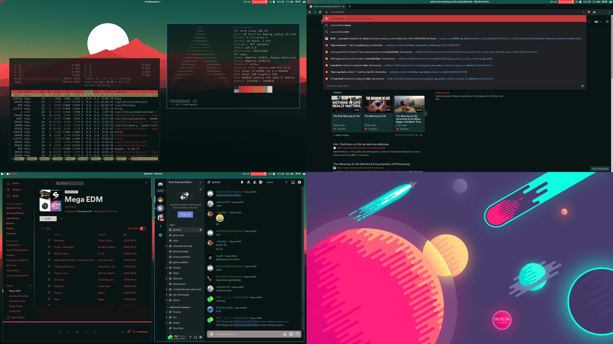

# Rhys' dotfiles

> NOTE: If you think somethink is wrong or missing, open an issue

## How to use this
### Things to install (all names are either in the official arch repos, or in the AUR):
- sway
- swaybar
- adapta-gtk-theme
- autotiling
- xorg-xhost
- polkit-gnome
- Fonts:
    - noto-fonts
    - ttf-croscore
    - ttf-font-awesome
    - adobe-source-code-pro-fonts
- kitty
- wofi
- pamixer
- playerctl
- light
- grim
- slurp
- wdisplays
- oh-my-zsh-git
- betterdiscordctl-git
- mako
- spicetify-cli

### Things you will need to do:
- Copy all things from this git repo into your home direcory (obviously)
- Configure minimum brightness for light
    - e.g. `light -N 1`
- Set zsh to your default shell
- Setup betterdiscord
    - Run `betterdiscordctl install`
- Setup spicetify
    - Change ownership with `chown -R USERNAME: /opt/spotify`
    - Apply theme with `spicetify backup apply`
- Make sure sway starts up including its environment variables
> NOTE: I am aware that the update bar module currently doesn't work. I am waiting for some changes upstream to happen

### Things you might need to change:
- Everywhere:
     - My display it 1920x1080. If you have a different resolution you are gonna need to change quite a bit
     - In quite a lot of place I have hard-coded my home directory, you will need to change these
- Sway:
    - Keyboard layout and input options
    - Output options
    - You may want to change some environment variable    
- Waybar:
    - For all of those freedom junkies out there, you might want to change the date format
    - You might need to change the name of the battery (or remove entirely if on desktop)
- Mako:
    - For mako icons to work you have to set a path to seach for icons. I currently have it set to Adwaita but if you use other icons you will need to change those as well
